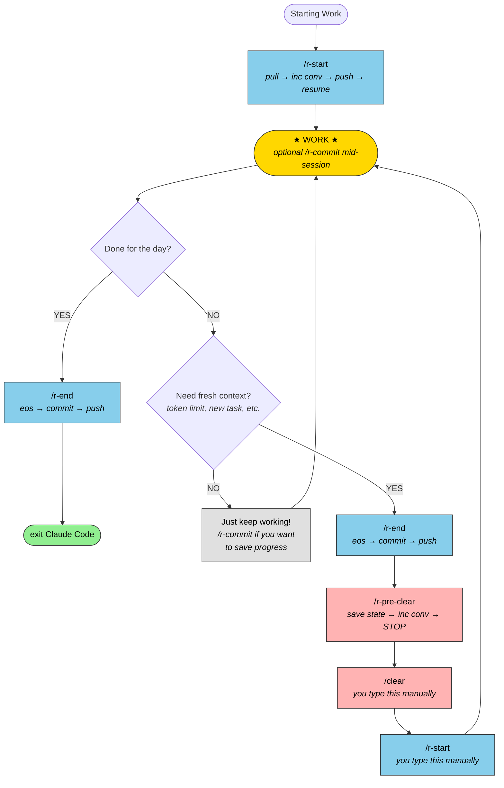

# Conversation Lifecycle Flowchart

## Mermaid Diagram



## ASCII Flowchart

```
┌─────────────────────────────────────────┐
│           STARTING WORK                 │
│                                         │
│  Always run /r-start                    │
│  (handles both cold + warm starts)      │
└──────────────┬──────────────────────────┘
               │
      ┌────────▼────────┐
      │    /r-start     │
      │                 │
      │ pull → inc conv │
      │ → push → resume │
      └────────┬────────┘
               │
               ▼
┌──────────────────────────┐
│                          │
│        ★ WORK ★          │
│                          │
│  (optional mid-session   │
│   /r-commit as needed)   │
│                          │
└────────────┬─────────────┘
             │
             ▼
┌──────────────────────────┐
│   READY TO SAVE WORK     │
│                          │
│   Am I done for the day? │
└────────────┬─────────────┘
             │
   ┌─────────┴─────────┐
   │                   │
┌──▼──┐           ┌────▼────┐
│ YES │           │   NO    │
└──┬──┘           └────┬────┘
   │                   │
   │                   ▼
   │         ┌──────────────────┐
   │         │ Do I need fresh  │
   │         │ context?         │
   │         │ (token limit,    │
   │         │  new task, etc.) │
   │         └────────┬─────────┘
   │                  │
   │           ┌──────┴──────┐
   │           │             │
   │      ┌────▼────┐   ┌───▼─────┐
   │      │  YES    │   │   NO    │
   │      └────┬────┘   └────┬────┘
   │           │             │
   │           │             ▼
   │           │    ┌─────────────────┐
   │           │    │  Just keep      │
   │           │    │  working!       │
   │           │    │                 │
   │           │    │  /r-commit if   │
   │           │    │  you want to    │
   │           │    │  save progress  │
   │           │    └─────────────────┘
   │           │
   │           ▼
   │  ┌─────────────────────┐
   │  │     /r-end          │
   │  │                     │
   │  │ eos → commit → push │
   │  └─────────┬───────────┘
   │            │
   │            ▼
   │  ┌─────────────────────┐
   │  │   /r-pre-clear      │
   │  │                     │
   │  │ save state →        │
   │  │ inc conv → STOP     │
   │  └─────────┬───────────┘
   │            │
   │            ▼
   │  ┌─────────────────────┐
   │  │   /clear            │
   │  │   (you type this)   │
   │  └─────────┬───────────┘
   │            │
   │            ▼
   │  ┌─────────────────────┐
   │  │   /r-start          │
   │  │   (you type this)   │
   │  │                     │
   │  │ pull → inc conv →   │
   │  │ push → resume       │
   │  └─────────┬───────────┘
   │            │
   │            ▼
   │     back to ★ WORK ★
   │
   ▼
┌─────────────────────┐
│      /r-end         │
│                     │
│ eos → commit → push │
└─────────┬───────────┘
          │
          ▼
┌─────────────────────┐
│      exit           │
│                     │
│  Close terminal or  │
│  Ctrl-C / "exit"   │
└─────────────────────┘
```

## Quick Reference

| I want to...                        | Run                                      |
|-------------------------------------|------------------------------------------|
| Start working (any context)         | `/r-start`                               |
| Save & keep working (fresh context) | `/r-end` → `/r-pre-clear` → `/clear` → `/r-start` |
| Save & keep working (same context)  | `/r-commit`                              |
| Save & quit for the day             | `/r-end` → `exit`                        |
| Save state without ending conv      | `/r-save-state`                          |
| Switch to other machine             | `/r-end` → `exit` → (other machine) `/r-start` |

## What Each Command Does

```
/r-start   = pull + increment conv + push + show resume context
/r-end     = session docs + commit + push + cleanup .conv-current
/r-pre-clear   = save state + increment conv locally + STOP (then YOU run /clear)
/r-resume  = read RESUME-STATE.md + PLAN.md (no git sync) — called internally by /r-start
/r-commit  = commit this folder only (Conv + Machine in message)
```
